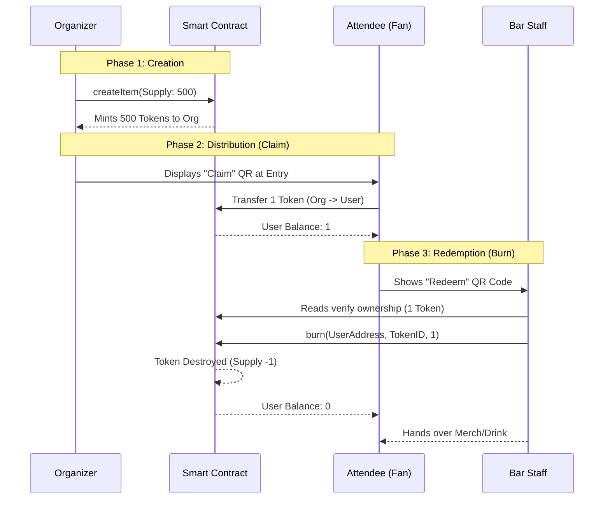

# Dropsland (Web3 DJs App)

> **Dropsland is a Web3-native application that connects music content, live events, and real-world access using NFTs as verifiable ownership and redemption primitives.**

The current application focuses on:
* A lightweight **Explore / Reels** experience for DJs and events.
* **Event-linked NFTs** that can be redeemed for merch, food, beverages, and access at Dropsland-organized IRL events.

Over time, Dropsland evolves into a broader access and ownership layer for music communities.

---

## The Problem 🚨

Live music and DJ events generate strong engagement, but the value created during those moments disappears immediately after the event.

*   **Fans** leave with tickets and memories, but no reusable digital ownership.
*   **DJs and organizers** lack a direct, persistent channel to engage attendees.
*   **Event perks** (merch, drinks, access) are managed with fragile, manual systems.

There is no native way to connect **event attendance**, **digital identity**, and **real-world utility** in a single system.

---

## What Dropsland Does Today 🚀

Dropsland introduces a **tokenized event layer** where:
*   DJs and organizers publish content through a simple Explore / Reels interface.
*   Attendees receive **NFTs linked to specific events or rewards**.
*   These NFTs act as **verifiable access and redemption assets** at IRL events.

**Ownership is on-chain.**
**Usage and redemption are handled through a fast off-chain system designed for real-world environments.**

---

## Core Application Components 🧩

### 1. Explore & Reels Layer
A lightweight content discovery layer where:
*   DJs and events are surfaced visually.
*   Content acts as an entry point to upcoming events and rewards.
*   No social graph or engagement farming in the MVP.

*This layer is intentionally simple and optimized for mobile usage at events.*

### 2. Event & Merch NFTs
NFTs represent **entitlements**, not speculative assets. Each NFT can correspond to:
*   A merch item 👕
*   A food or beverage 🍹
*   VIP or restricted access 🎟️
*   A collectible proof of attendance 🏅

NFT ownership is used to:
*   Verify eligibility.
*   Unlock redemption.
*   Provide post-event digital ownership.

*NFTs are not spent by default; redemption state is tracked off-chain for speed and reliability during events.*

### 3. IRL Redemption Flow

At events:
1.  Users open the Dropsland app and display their NFT.
2.  A QR code or wallet proof is scanned by staff.
3.  The backend verifies ownership and redemption status.
4.  The perk is delivered.



*This design avoids on-chain transactions at the point of sale, ensuring fast throughput and low friction.*

---

## Technical Architecture 🏗️

### On-Chain Layer
Responsible for **ownership and verifiability**:
*   **Event NFT Contracts**: Mint NFTs tied to specific events or rewards (Standard NFT interfaces).
*   **Optional DJ Token Contracts (future layer)**: Membership or access tokens.

*The blockchain is used strictly as a source of truth for asset ownership.*

### Off-Chain Layer
Responsible for **UX, performance, and operations**:
*   Event and reward metadata.
*   Content indexing for Explore / Reels.
*   Ownership caching and indexing.
*   Redemption tracking (per NFT, per event).
*   Staff authentication and scanning tools.

*This layer enables fast event operations, manual overrides, and analytics.*

### Access & Verification Model
*   Ownership checks are performed via indexers or RPC calls.
*   Redemption eligibility is enforced by the backend.
*   QR codes are short-lived and session-bound to prevent abuse.

*This hybrid model balances decentralization with real-world usability.*

---

## Vision 🔮

Dropsland is designed to evolve incrementally. Future layers may include:
*   DJ membership tokens.
*   Token-gated digital content.
*   Recurring fan access.
*   Advanced event economics.

All future functionality builds on the same primitives introduced in the MVP: **verifiable ownership, composable access, and real-world utility**.

---

# Dropsland Application Structure 📱

Dropsland is a mobile-first application organized around **five core sections**, accessible through a persistent bottom navigation dock.

The structure is designed to support two primary use cases:
1.  **Discovery and engagement** around DJs and events.
2.  **Ownership and redemption** of digital assets at real-world events.

### Bottom Navigation Layout
```
[ Reels ]  [ Explore ]  [ Wallet ]  [ Activity ]  [ Profile ]
```

Each section owns a specific part of the user journey and does not overlap responsibilities with the others.

---

## 1. Reels (Home) 🎥
**Purpose**: The primary entry point, designed for passive discovery and event promotion.

**Responsibilities**:
*   Surface short-form DJ and event content.
*   Highlight upcoming Dropsland events and activations.
*   Drive interest/traffic toward events and rewards.

**Key Characteristics**: Scroll-based, mobile-optimized, visual.

---

## 2. Explore 🧭
**Purpose**: Supports intentional discovery of DJs, events, and collections.

**Responsibilities**:
*   Browse DJs, events, and past Dropsland activations.
*   Search and filter by location, date, or category.
*   Act as a directory for the ecosystem.

**Key Characteristics**: Structured, searchable, filter-based.

---

## 3. Create (Music / Posts) ➕
**Purpose**: Reserved for creators and organizers to publish content.

**Responsibilities**:
*   Upload music clips or videos.
*   Publish posts or announcements.
*   Link content to events or NFTs.

**Key Characteristics**: Creator-only functionality.

---

## 4. Wallet 💼
**Purpose**: The core **ownership and utility hub**. "My Passes & Rewards".

**Structure**:
```
[ Events ]  [ Rewards ]  [ Creator Coins ]
```

*   **Events**: Event access NFTs, attendance passes.
*   **Rewards**: Merch NFTs, F&B entitlements. *Redemption logic is optimized for speed.*
*   **Creator Coins**: DJ creator tokens (viewing held assets).

**Key Principles**: Asset-based UI, no technical jargon, optimized for fast access.

---

## 5. Profile 👤
**Purpose**: Represents the user’s identity and history.

**Responsibilities**:
*   Display user info.
*   Show past events and collected assets.
*   Manage preferences.

---

## Navigation & User Flow Design 🗺️

**Event Attendee Flow**:
`Reels → Event → Claim NFT → Wallet → Show QR → Redeem`

**Explorer / Fan Flow**:
`Explore → DJ or Event → Follow / Save`

**Creator Flow**:
`Create → Upload Content → Link to Event or Reward`

---

## Design Philosophy 🎨
*   Event-first, mobile-first.
*   Ownership over speculation.
*   Minimal on-chain logic, maximum real-world usability.
*   Clear separation of concerns per section.
